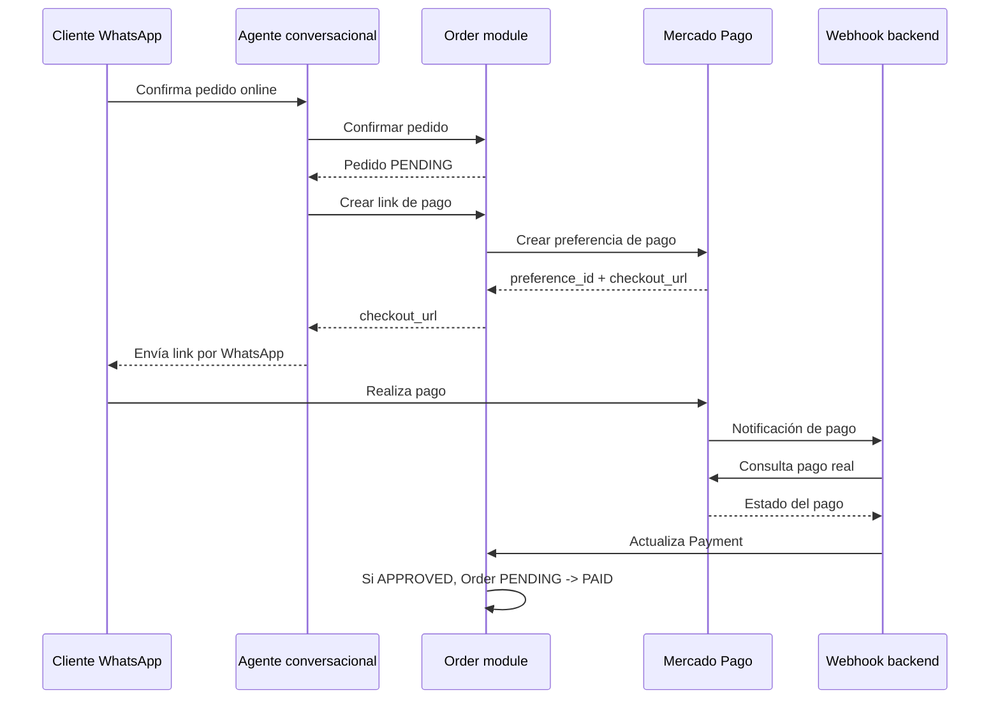

# Plan de implementación: pagos con Mercado Pago

## Contexto

Rapidfood es un backend Python con Django 5/DRF como capa HTTP y Prisma Client Python como dueño de la base de datos. La lógica de negocio vive en módulos independientes bajo arquitectura hexagonal.

La tarea de Notion **"Implementar pagos con MercadoPago"** está en estado `Not started`, pero no contiene detalle adicional. Por eso este plan se basa en:

- `docs/reglas-negocio.md`
- `docs/req-funcionales.md`
- `docs/order-state-machine.md`
- `docs/modelo-dominio.md`
- la estructura actual de `api/modules/order/` y `api/modules/conversation/`

## Objetivo

Permitir que el agente conversacional de WhatsApp genere un link de pago de Mercado Pago para un pedido confirmado, lo envíe al comprador y espere la validación del pago antes de considerar el pedido pagado.

## Alcance funcional

### Incluido

- Generar link de pago para pedidos online en estado `PENDING`.
- Registrar cada intento de pago online como `Payment` en estado `PENDING`.
- Asociar el pago al pedido.
- Recibir notificaciones/webhooks de Mercado Pago.
- Consultar el recurso real en Mercado Pago antes de actualizar el estado local.
- Actualizar el pago local a `APPROVED`, `REJECTED`, `FAILED` o `EXPIRED`.
- Mover la orden de `PENDING` a `PAID` cuando el pago sea aprobado.
- Mantener la orden en `PENDING` cuando el pago sea rechazado, fallido o vencido.
- Exponer endpoints REST para generación del link y recepción de webhook.
- Preparar integración con el agente conversacional para enviar el link por WhatsApp.

### Fuera de alcance inicial

- Reembolsos.
- Conciliación contable avanzada.
- Múltiples proveedores de pago.
- Panel administrativo completo de pagos.
- Suscripciones o pagos recurrentes.
- Captura manual de tarjetas dentro del sistema.

## Reglas de negocio relacionadas

Según `docs/reglas-negocio.md`:

- `RN-038`: cada intento de pago online crea un pago en estado pendiente y se asocia al pedido.
- `RN-039`: si el estado del pago cambia a aprobado y el pedido está en `PENDIENTE`, el pedido pasa a `PAGADO`.
- `RN-040`: si el estado del pago cambia a rechazado, fallido o vencido, el pedido permanece en `PENDIENTE`.
- `RN-041`: si el método de pago es en efectivo, el pedido pasa a `CONFIRMADO` cuando el negocio acepta el pedido.

Según `docs/req-funcionales.md`:

- `REQ-047`: el sistema debe generar un enlace de pago cuando el método de pago es online y el pedido está en `PENDIENTE`.
- `REQ-048`: el sistema debe registrar un pago en estado pendiente al crear el enlace de pago.
- `REQ-049`: el sistema debe recibir notificaciones del proveedor y actualizar el estado del pago.
- `REQ-050`: si el pago pasa a aprobado, el sistema debe actualizar el estado del pedido a `PAGADO`.
- `REQ-051`: si el pago pasa a rechazado, fallido o vencido, el pedido debe permanecer en `PENDIENTE` y el agente debe ofrecer reintentar el pago.

## Decisión arquitectónica

Implementar la capacidad de pagos inicialmente dentro del bounded context `order`.

### Motivo

El modelo actual ya relaciona `Payment` con `Order`, y las reglas de pago forman parte directa del ciclo de vida del pedido. Mercado Pago debe ingresar como un adaptador externo, no como lógica embebida en el agente conversacional ni en las views de DRF.

### Alternativa descartada por ahora

Crear un módulo independiente `payment`.

**Ventajas:**

- Mejor separación si el dominio de pagos crece.
- Más adecuado para múltiples proveedores, reembolsos, conciliación y auditoría avanzada.

**Desventajas:**

- Agrega complejidad prematura.
- Todavía no hay suficiente comportamiento propio de pagos para justificar otro bounded context.

## Diseño de alto nivel



## Cambios propuestos

### 1. Dominio

Crear:

`api/modules/order/domain/models/payment.py`

Responsabilidad:

- Representar un intento de pago asociado a una orden.
- Usar estados propios del dominio: `PENDING`, `APPROVED`, `REJECTED`, `FAILED`, `EXPIRED`.

Evaluar si conviene agregar:

- `api/modules/order/domain/models/payment_status.py`

Actualmente `PaymentStatus` existe en Prisma, pero conviene evitar que el dominio dependa del enum generado por Prisma.

### 2. Puertos driven

Crear en:

`api/modules/order/application/ports/driven/`

#### `payment_repository.py`

Responsabilidades:

- Crear pago pendiente.
- Buscar pago por id local.
- Buscar pago por `external_id`.
- Buscar último pago pendiente de una orden.
- Actualizar estado de pago.
- Listar pagos de una orden.

#### `payment_provider.py`

Responsabilidades:

- Crear una preferencia/link de pago.
- Consultar un pago por id externo.
- Normalizar estados del proveedor.

El puerto debe hablar en términos de la aplicación, no de Mercado Pago. Ejemplo conceptual:

```text
create_payment_link(request) -> PaymentLinkResult
get_payment_status(external_payment_id) -> ProviderPaymentStatus
```

### 3. Casos de uso

Crear en:

`api/modules/order/application/use_cases/`

#### `create_payment_link_use_case.py`

Flujo:

1. Buscar pedido por `order_id`.
2. Validar que exista.
3. Validar que esté en `PENDING`.
4. Validar que `payment_type == ONLINE`.
5. Validar que tenga `total_amount`.
6. Crear o registrar un `Payment` local en estado `PENDING`.
7. Invocar el `PaymentProvider`.
8. Guardar identificadores externos y link generado.
9. Devolver el link para que pueda ser enviado por WhatsApp.

#### `process_payment_notification_use_case.py`

Flujo:

1. Recibir una notificación normalizada del proveedor.
2. Buscar el pago remoto usando el proveedor.
3. Mapear el estado remoto al estado local.
4. Actualizar el `Payment`.
5. Si el pago queda `APPROVED` y la orden está en `PENDING`, mover la orden a `PAID`.
6. Si el pago queda `REJECTED`, `FAILED` o `EXPIRED`, mantener la orden en `PENDING`.
7. Devolver resultado idempotente para el webhook.

### 4. Persistencia Prisma

El schema ya contiene:

```prisma
model Payment {
  id         String        @id @default(uuid()) @map("payment_id") @db.Uuid
  orderId    String        @map("order_id") @db.Uuid
  order      Order         @relation(fields: [orderId], references: [id], onDelete: Cascade)
  provider   String
  externalId String?       @map("external_id")
  status     PaymentStatus @default(PENDING)
  amount     Decimal       @db.Decimal(10, 2)
  createdAt  DateTime      @default(now()) @map("created_at")
  updatedAt  DateTime      @updatedAt @map("updated_at")

  @@index([orderId])
  @@map("payment")
}
```

Para Checkout Pro con link de pago, se recomienda evaluar agregar:

```prisma
preferenceId       String?  @map("preference_id")
checkoutUrl        String?  @map("checkout_url")
externalReference  String?  @map("external_reference")
providerPayload    Json?    @map("provider_payload")
expiresAt          DateTime? @map("expires_at")
```

Motivo:

- `preferenceId`: permite identificar la preferencia de Mercado Pago.
- `checkoutUrl`: permite reenviar o auditar el link enviado por WhatsApp.
- `externalReference`: permite asociar inequívocamente el recurso externo con el pedido local.
- `providerPayload`: ayuda a depurar diferencias entre ambientes sandbox/producción.
- `expiresAt`: permite manejar links vencidos y reintentos.

### 5. Adaptador Prisma

Crear:

`api/modules/order/infrastructure/adapters/driven/prisma/payment_repository.py`

Responsabilidad:

- Implementar `PaymentRepository`.
- Traducir entre registros Prisma y entidades puras de dominio.
- No contener reglas de negocio.

Si el mapper empieza a crecer, crear:

`api/modules/order/infrastructure/adapters/driven/prisma/mappers/payment_mapper.py`

### 6. Adaptador Mercado Pago

Crear:

`api/modules/order/infrastructure/adapters/driven/mercadopago/`

Archivos sugeridos:

- `mercadopago_payment_provider.py`
- `mercadopago_status_mapper.py`
- `mercadopago_settings.py`

Responsabilidades:

- Usar el SDK/API de Mercado Pago.
- Crear preferencias de pago.
- Enviar `external_reference` con el `order_id`.
- Configurar `notification_url`.
- Mapear estados remotos a estados locales.
- Aislar cualquier detalle del proveedor fuera de application/domain.

Variables de entorno sugeridas:

```text
MERCADOPAGO_ACCESS_TOKEN=
MERCADOPAGO_PUBLIC_KEY=
MERCADOPAGO_WEBHOOK_SECRET=
MERCADOPAGO_NOTIFICATION_URL=
MERCADOPAGO_SUCCESS_URL=
MERCADOPAGO_FAILURE_URL=
MERCADOPAGO_PENDING_URL=
```

## Endpoints REST

### Crear link de pago

```http
POST /api/orders/{order_id}/payment-link/
```

Respuesta esperada:

```json
{
  "order_id": "uuid",
  "payment_id": "uuid",
  "provider": "MERCADOPAGO",
  "checkout_url": "https://...",
  "status": "PENDING"
}
```

### Recibir webhook de Mercado Pago

```http
POST /api/orders/payments/mercadopago/webhook/
```

Responsabilidades del endpoint:

- Validar firma del proveedor cuando esté configurada.
- Responder rápido `200` o `201` ante notificaciones recibidas correctamente.
- Delegar el procesamiento real al caso de uso.
- No tener reglas de negocio dentro de la view.

## Integración con conversación y WhatsApp

Una vez que el módulo `order` pueda generar links de pago:

1. El agente detecta confirmación explícita del pedido.
2. Confirma el pedido: `DRAFT -> PENDING`.
3. Si `payment_type == ONLINE`, solicita un link de pago mediante un puerto de aplicación.
4. Envía el link por WhatsApp.
5. Informa que el pedido queda pendiente hasta recibir confirmación del proveedor.
6. Cuando el webhook aprueba el pago, el sistema podrá enviar una notificación al cliente.

Mensaje sugerido:

```text
Perfecto, tu pedido quedó pendiente de pago.
Pagalo acá: <link>
Cuando Mercado Pago confirme el pago, te aviso y seguimos con la preparación.
```

Cuando se aprueba:

```text
Pago confirmado ✅ Tu pedido ya fue recibido y está esperando preparación.
```

Si falla/rechaza/vence:

```text
No pudimos confirmar el pago. Tu pedido sigue pendiente.
¿Querés que te mande un nuevo link para reintentarlo?
```

## Plan de trabajo por fases

### Fase 1: Base de dominio y contratos

- [ ] Crear entidad de dominio `Payment`.
- [ ] Crear enum/value object de estado de pago si no existe en dominio.
- [ ] Crear puerto `PaymentRepository`.
- [ ] Crear puerto `PaymentProvider`.
- [ ] Agregar DTOs/comandos/respuestas para link y notificación.

### Fase 2: Caso de uso para link de pago

- [ ] Crear tests unitarios para `CreatePaymentLinkUseCase`.
- [ ] Implementar validaciones de orden.
- [ ] Crear pago pendiente.
- [ ] Invocar provider fake en tests.
- [ ] Retornar `checkout_url`.

### Fase 3: Persistencia

- [ ] Evaluar y aplicar cambios necesarios en `schema.prisma`.
- [ ] Regenerar cliente Prisma si corresponde.
- [ ] Implementar `PrismaPaymentRepository`.
- [ ] Agregar tests de integración de persistencia.

### Fase 4: Adapter Mercado Pago

- [ ] Agregar dependencia `mercadopago` al `pyproject.toml`.
- [ ] Implementar configuración desde variables de entorno.
- [ ] Implementar creación de preferencia.
- [ ] Mapear respuesta del proveedor.
- [ ] Manejar errores del SDK/API sin filtrar detalles externos al dominio.

### Fase 5: Endpoint para generación de link

- [ ] Crear serializer de request/response si hace falta.
- [ ] Crear view DRF.
- [ ] Registrar ruta.
- [ ] Agregar tests REST.

### Fase 6: Webhook y actualización de estado

- [ ] Crear tests unitarios para `ProcessPaymentNotificationUseCase`.
- [ ] Implementar consulta remota del pago.
- [ ] Actualizar `Payment`.
- [ ] Avanzar orden `PENDING -> PAID` sólo si corresponde.
- [ ] Mantener orden `PENDING` en rechazos/fallos/vencimientos.
- [ ] Hacer procesamiento idempotente ante webhooks duplicados.

### Fase 7: Integración conversacional

- [ ] Crear puerto de conversación para solicitar link de pago.
- [ ] Implementar adaptador cross-module desde conversation hacia order.
- [ ] Modificar el flujo de confirmación online para devolver el link.
- [ ] Agregar mensajes de reintento ante pagos fallidos.
- [ ] Tener en cuenta que actualmente el container de conversation usa repositorios en memoria; hay que resolver el wiring real antes de confiar en pruebas end-to-end.

### Fase 8: Verificación

- [ ] Ejecutar tests unitarios del módulo order.
- [ ] Ejecutar tests REST de order.
- [ ] Ejecutar tests del webhook.
- [ ] Ejecutar import-linter.
- [ ] Probar manualmente con URL HTTPS pública/túnel para recibir webhooks.

## Casos de prueba mínimos

### Link de pago

- [ ] No genera link si la orden no existe.
- [ ] No genera link si la orden no está en `PENDING`.
- [ ] No genera link si la orden no tiene método de pago `ONLINE`.
- [ ] No genera link si la orden no tiene total.
- [ ] Crea `Payment` en `PENDING`.
- [ ] Devuelve `checkout_url`.
- [ ] Persiste identificadores externos.

### Webhook

- [ ] Rechaza webhook con firma inválida si la validación está activa.
- [ ] Responde correctamente a notificación válida.
- [ ] Consulta el pago real en Mercado Pago.
- [ ] Mapea pago aprobado a `APPROVED`.
- [ ] Mapea pago rechazado a `REJECTED`.
- [ ] Mapea pago fallido a `FAILED`.
- [ ] Mapea pago vencido a `EXPIRED`.
- [ ] Si pago aprobado y orden está `PENDING`, orden pasa a `PAID`.
- [ ] Si pago fallido/rechazado/vencido, orden permanece en `PENDING`.
- [ ] Webhooks duplicados no rompen estado ni duplican efectos.

### Conversación

- [ ] Al confirmar pedido online, el agente envía link de pago.
- [ ] El agente informa que el pedido queda pendiente.
- [ ] Ante pago aprobado, el cliente puede ser notificado.
- [ ] Ante pago fallido, el agente ofrece reintentar.

## Riesgos y mitigaciones

### Webhook no llega en desarrollo

Mercado Pago requiere una URL pública HTTPS para notificaciones reales.

**Mitigación:** usar un túnel HTTPS durante desarrollo y configurar `MERCADOPAGO_NOTIFICATION_URL`.

### Duplicación de notificaciones

Mercado Pago puede reenviar notificaciones si no recibe confirmación.

**Mitigación:** procesamiento idempotente usando `external_id`, `preference_id` o `external_reference`.

### Estado local inconsistente

No se debe confiar únicamente en el payload del webhook.

**Mitigación:** al recibir notificación, consultar el recurso real en Mercado Pago antes de actualizar el sistema.

### Acoplamiento con Mercado Pago

Si el SDK entra en application/domain, se rompe la arquitectura hexagonal.

**Mitigación:** Mercado Pago sólo debe vivir en infraestructura, detrás de `PaymentProvider`.

### Integración incompleta con conversation

El container actual de conversation todavía usa repositorios en memoria y no todos los puertos reales.

**Mitigación:** integrar pagos con conversation sólo después de tener el flujo de order sólido y revisar el wiring real.

## Criterios de aceptación final

- [ ] Un pedido online confirmado queda en `PENDING`.
- [ ] El backend genera un link de Mercado Pago.
- [ ] El link se registra junto al intento de pago.
- [ ] El agente puede enviar el link por WhatsApp.
- [ ] El pago local queda en `PENDING`.
- [ ] El webhook actualiza el pago según el estado remoto real.
- [ ] Pago aprobado mueve orden a `PAID`.
- [ ] Pago rechazado/fallido/vencido mantiene orden en `PENDING`.
- [ ] El agente puede ofrecer reintento de pago.
- [ ] La implementación respeta arquitectura hexagonal.
- [ ] `domain` no importa Django, DRF, Prisma ni Mercado Pago.
- [ ] Las views sólo traducen HTTP a comandos/casos de uso.

## Referencias externas verificadas

- Mercado Pago Python SDK: https://github.com/mercadopago/sdk-python
- Mercado Pago Preferences API: https://www.mercadopago.com.mx/developers/es/reference/online-payments/checkout-pro-preferences/create-preference/post
- Mercado Pago Webhooks: https://www.mercadopago.com.mx/developers/es/docs/links-and-debts/additional-content/your-integrations/notifications/webhooks
- Mercado Pago payment notifications: https://www.mercadopago.com.br/developers/en/docs/checkout-pro-preferences/payment-notifications
