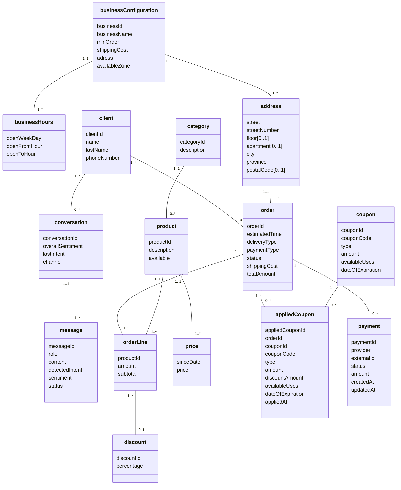

```mermaid
classDiagram
    class businessConfiguration {
        businessId
        businessName
        minOrder
        shippingCost
        adress
        availableZone
    }

    class businessHours {
        openWeekDay
        openFromHour
        openToHour
    }

    class address {
        street
        streetNumber
        floor[0..1]
        apartment[0..1]
        city
        province
        postalCode[0..1]
    }

    class client {
        clientId
        name
        lastName
        phoneNumber
    }

    class conversation {
        conversationId
        overallSentiment
        lastIntent
        channel
    }

    class message {
        messageId
        role
        content
        detectedIntent
        sentiment
        status
    }

    class order {
        orderId
        estimatedTime
        deliveryType
        paymentType
        status
        shippingCost
        totalAmount
    }

    class orderLine {
        productId
        amount
        subtotal
    }

    class product {
        productId
        description
        available
    }

    class price {
        sinceDate
        price
    }

    class category {
        categoryId
        description
    }

    class discount {
        discountId
        percentage
    }

    class coupon {
        couponId
        couponCode
        type
        amount
        availableUses
        dateOfExpiration
    }

    class appliedCoupon {
        appliedCouponId
        orderId
        couponId
        couponCode
        type
        amount
        discountAmount
        availableUses
        dateOfExpiration
        appliedAt
    }

    class payment {
        paymentId
        provider
        externalId
        status
        amount
        createdAt
        updatedAt
    }

    businessConfiguration "1..1" -- "1..*" businessHours
    businessConfiguration "1..1" -- "1..*" address
    client "1..*" -- "0..*" conversation
    conversation "1..1" -- "1..*" message
    client "1..*" -- "0..*" order
    address "1..1" -- "1..*" order

    order "1" -- "1..*" orderLine
    product "1..1" -- "1..*" orderLine
    orderLine "1..*" -- "0..1" discount

    product "1..1" -- "1..*" price
    category "1..1" -- "0..*" product

    order "1" -- "0..*" appliedCoupon
    coupon "1" -- "0..*" appliedCoupon

    order "1" -- "0..*" payment
```
