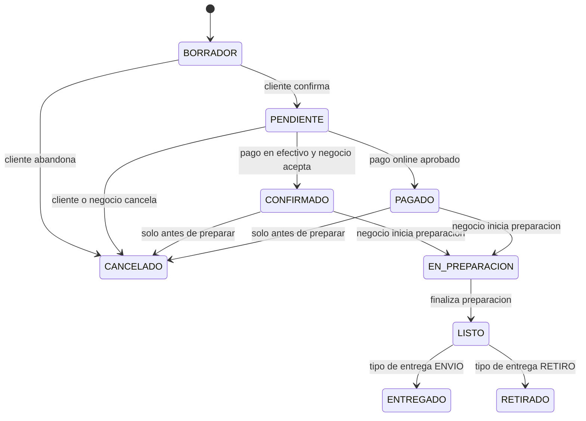

```mermaid
stateDiagram-v2
    [*] --> BORRADOR

    BORRADOR --> PENDIENTE: cliente confirma
    BORRADOR --> CANCELADO: cliente abandona

    PENDIENTE --> PAGADO: pago online aprobado
    PENDIENTE --> CONFIRMADO: pago en efectivo y negocio acepta
    PENDIENTE --> CANCELADO: cliente o negocio cancela

    CONFIRMADO --> EN_PREPARACION: negocio inicia preparacion
    PAGADO --> EN_PREPARACION: negocio inicia preparacion

    EN_PREPARACION --> LISTO: finaliza preparacion

    LISTO --> ENTREGADO: tipo de entrega ENVIO
    LISTO --> RETIRADO: tipo de entrega RETIRO

    CONFIRMADO --> CANCELADO: solo antes de preparar
    PAGADO --> CANCELADO: solo antes de preparar
```
