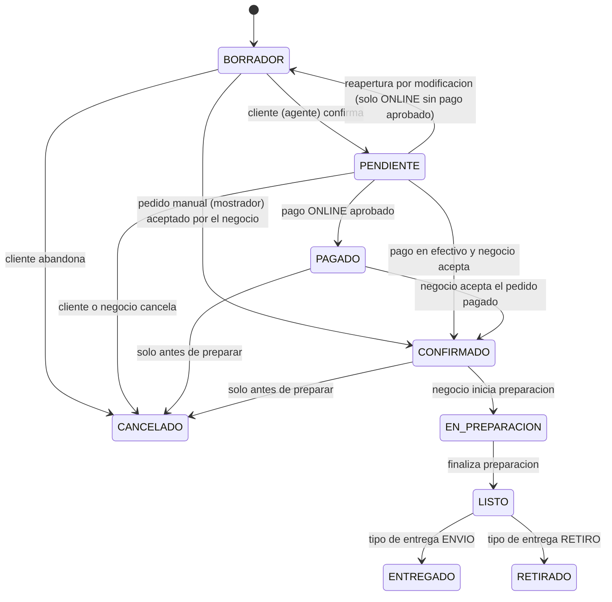

## Reglas implementadas

- **`PAGADO` (PAID)** solo lo produce un pago online **verificado por el proveedor** (webhook de Mercado Pago). Un pedido manual **nunca** pasa por `PAGADO` aunque se cobre: el pedido manual nace aceptado por el operador y va directo a `CONFIRMADO`.
- **Origen**: `IN_PLACE` (mostrador/POS) confirma a `CONFIRMADO`; `AGENT` (WhatsApp/IA) confirma a `PENDIENTE` y espera la liquidacion (pago online -> `PAGADO`, efectivo aceptado -> `CONFIRMADO`).
- **`PENDIENTE -> PAGADO`** solo si `paymentType = ONLINE`; **`PENDIENTE -> CONFIRMADO`** solo si `paymentType = CASH`. Si el metodo no esta especificado (pedidos manuales viejos), ambas transiciones quedan disponibles para el operador.
- **Reapertura**: `PENDIENTE -> BORRADOR` solo para pedidos `ONLINE` sin un intento de pago aprobado de la version actual. Modificar invalida la confirmacion (`confirmedAt` se limpia) y supersede el checkout anterior; hay que volver a confirmar.
- **Cancelacion**: permitida solo desde `BORRADOR`, `PENDIENTE`, `PAGADO` o `CONFIRMADO` (nunca desde `EN_PREPARACION` o posterior).
- Un pedido con pago aprobado de la version actual queda inmutable: un nuevo producto implica un pedido nuevo.
