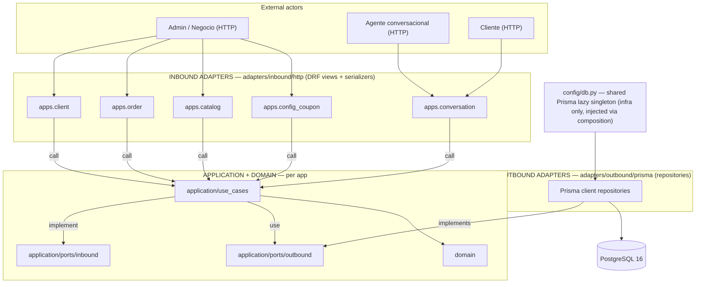
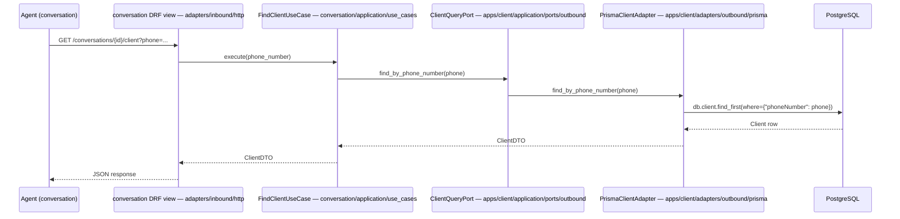

# Design: scaffold-inicial — Rapidfood shared foundation

## Technical Approach

One uv-managed Python 3.13 monorepo where **Django 5 + DRF is only the inbound HTTP layer** and **Prisma Client Python owns the entire data layer** (zero `django.db.models`; `prisma migrate dev` is the single source of truth). Five empty hexagonal apps (client, conversation, order, catalog, config_coupon) ship with full folder skeletons, port contracts (Protocols, no implementations), import-linter architecture gates, Docker Postgres, and a pytest infra whose session fixture runs `prisma migrate deploy` against the test DB. No business logic — this change only unblocks parallel per-app Strict TDD.

Verification notes (deviations from upstream text, with evidence):
- **OrderStatus has 9 states, not 8** — `docs/order-state-machine.md` defines BORRADOR, PENDIENTE, PAGADO, CONFIRMADO, EN_PREPARACION, LISTO, ENTREGADO, RETIRADO, CANCELADO (RN-001 requires BORRADOR in the enum).
- **modelo-dominio.md defines 15 entities, not 16** — the class diagram contains 15 classes; the schema below maps all 15.
- **`order.conversationId` (nullable FK) replaces the suggested `conversation.draftOrderId`** — RN-030 ("Un pedido en BORRADOR debe tener referencia a la conversacion") puts the reference on the order; RN-031 (a conversation may have multiple PENDIENTE+ orders) requires a many-orders-per-conversation shape, impossible with a single `draftOrderId` pointer. "One active BORRADOR per conversation" (RN-028) stays a use-case rule (Prisma has no partial unique index).

## Architecture Overview



Cross-app rule: **all edges between apps land on `application/ports`** — e.g. conversation's use cases import `OrderDraftPort` from `apps.order.application.ports.inbound` and `ClientQueryPort`/`ClientCommandPort` from `apps.client.application.ports.outbound`. No app ever imports another app's `adapters/`, `use_cases/`, or `domain/`. Composition roots (`apps/*/composition/container.py`) bind concrete adapters to use cases; the shared Prisma instance from `config/db.py` is injected into outbound adapters via constructors.

## Directory Layout

```
rapidfood/
├── .env.example              # DATABASE_URL + DJANGO_* (cp .env.example .env)
├── .gitignore                # .env, .venv, __pycache__, generated prisma artifacts
├── README.md                 # setup steps (commands below)
├── docker-compose.yml        # postgres:16, named volume, healthcheck, port 5432
├── manage.py                 # standard Django entry point
├── pyproject.toml            # uv project; deps + [tool.importlinter] + [tool.pytest.ini_options]
├── schema.prisma             # SINGLE source of truth (all 15 entities)
├── uv.lock
├── config/                   # Django project package
│   ├── __init__.py
│   ├── settings.py           # single env-driven settings module (see §Django)
│   ├── urls.py               # routes: /health + per-app inbound adapters
│   ├── views.py              # /health JsonResponse view
│   ├── db.py                 # Prisma lazy singleton (shared infra, injected, never global for use cases)
│   ├── wsgi.py
│   └── asgi.py
├── prisma/
│   └── migrations/           # prisma migrate dev output (committed; generated name 20260803xxxxxx_init)
│       ├── migration.sql
│       └── migration_lock.toml
├── apps/
│   ├── __init__.py           # REQUIRED: real package → import-linter dotted paths + INSTALLED_APPS
│   ├── client/               # ⬇ full shape shown once; siblings identical
│   │   ├── __init__.py
│   │   ├── apps.py           # default AppConfig
│   │   ├── models.py         # MUST stay EMPTY (Prisma owns all tables; makemigrations = no-op)
│   │   ├── migrations/       # empty dir, never populated
│   │   ├── domain/
│   │   │   ├── __init__.py
│   │   │   └── client.py     # pure entities/value objects (no framework imports)
│   │   ├── application/
│   │   │   ├── __init__.py
│   │   │   ├── ports/
│   │   │   │   ├── __init__.py
│   │   │   │   ├── inbound/__init__.py
│   │   │   │   └── outbound/
│   │   │   │       ├── __init__.py
│   │   │   │       ├── client_query_port.py
│   │   │   │       └── client_command_port.py
│   │   │   └── use_cases/__init__.py        # empty in scaffold (later per-app changes)
│   │   ├── adapters/
│   │   │   ├── __init__.py
│   │   │   ├── inbound/
│   │   │   │   ├── __init__.py
│   │   │   │   └── http/
│   │   │   │       ├── __init__.py
│   │   │   │       ├── views.py             # empty skeleton
│   │   │   │       └── serializers.py       # empty skeleton
│   │   │   └── outbound/
│   │   │       ├── __init__.py
│   │   │       └── prisma/
│   │   │           ├── __init__.py
│   │   │           └── prisma_client_repository.py   # empty skeleton (implements ClientQueryPort later)
│   │   └── composition/
│   │       ├── __init__.py
│   │       └── container.py # empty wiring skeleton
│   ├── conversation/         # same shape; use_cases consume 6 ports (see §Ports)
│   ├── order/                # same shape; + application/ports/inbound/order_draft_port.py
│   ├── catalog/              # same shape; + application/ports/outbound/product_query_port.py
│   └── config_coupon/        # same shape; + ports/outbound/{coupon_query_port,business_config_query_port}.py
└── tests/
    ├── conftest.py           # session fixtures: prisma_test_db + db (see §Testing)
    └── test_db_smoke.py      # proves Prisma tables exist via migrate deploy
```

## Prisma Schema Design

### Entity → model mapping (from `docs/modelo-dominio.md`)

| Model | Key fields | Type / default decisions |
|---|---|---|
| businessConfiguration | businessName, minOrder, shippingCost, availableZone | minOrder/shippingCost `Decimal(10,2)`. Doc's literal `adress` scalar is DROPPED — the Address table (1..\*) is the source of address data. |
| businessHours | openWeekDay, openFromHour, openToHour | openWeekDay `WeekDay` enum; hours as `String "HH:MM"` (Prisma has no TIME type) |
| address | street, streetNumber, floor?, apartment?, city, province, postalCode? | streetNumber `String` (may contain letters); optional fields nullable; owned by businessConfiguration (Cascade) |
| client | name, lastName, phoneNumber | `phoneNumber @unique` (agent identity by phone) |
| conversation | overallSentiment?, lastIntent?, channel | channel `String` (open vocab); clientId nullable (chat may precede identification) |
| message | role, content, detectedIntent?, sentiment?, status? | role/status `String` (open vocab per proposal decision); conversationId required (Cascade) |
| order | estimatedTime?, deliveryType?, paymentType?, status, shippingCost?, totalAmount? | `status @default(BORRADOR)`; deliveryType/paymentType nullable until REQ-033; totals/estimatedTime nullable until computed (RN-025/032/034); clientId/addressId/conversationId nullable FKs |
| orderLine | productId, amount, unitPrice?, subtotal | `amount Int` = quantity (Q9 resolved); `unitPrice Decimal?` snapshot NULL during BORRADOR, frozen at confirm (RN-024/035); `subtotal Decimal` recomputed on draft edits (RN-032); `@@unique([orderId, productId])` = one line per product (upsert in add_line); discountId nullable (0..1) |
| product | description, available | `available Boolean @default(true)`; categoryId required ("1..1" per diagram) |
| price | sinceDate, price | price history; current = max(sinceDate) ≤ now; `@@index([productId, sinceDate])` |
| category | description | — |
| discount | percentage | `Decimal(5,2)` (0–100) |
| coupon | couponCode, type, amount, availableUses, dateOfExpiration? | type `String` (FIXED_AMOUNT/PERCENTAGE etc. — open vocab); couponCode `@unique`; dateOfExpiration nullable |
| appliedCoupon | couponCode, type, amount, discountAmount, availableUses, dateOfExpiration?, appliedAt | FULL coupon snapshot per RN-033/034 (price/coupon freezing); couponId nullable so snapshot survives coupon deletion (SetNull); discountAmount = actual applied discount |
| payment | provider, externalId?, status, amount, createdAt, updatedAt | `status @default(PENDIENTE)`; `updatedAt @updatedAt` |

### Draft `schema.prisma` (apply phase refines)

```prisma
generator client {
  provider             = "prisma-client-py"
  interface            = "sync"          // sync: matches WSGI sync views
  recursive_type_depth = 5
}

datasource db {
  provider = "postgresql"
  url      = env("DATABASE_URL")
}

// ——— Enums: ONLY doc-fixed vocabularies (native PG enums are costly to alter) ———
enum OrderStatus { BORRADOR PENDIENTE PAGADO CONFIRMADO EN_PREPARACION LISTO ENTREGADO RETIRADO CANCELADO }   // 9 states, verified from order-state-machine.md
enum DeliveryType { ENVIO RETIRO }
enum PaymentType { EFECTIVO ONLINE }
enum PaymentStatus { PENDIENTE APROBADO RECHAZADO FALLIDO VENCIDO }
enum WeekDay { LUNES MARTES MIERCOLES JUEVES VIERNES SABADO DOMINGO }

// ——— Models: snake_case via @map / @@map; String @id @default(uuid()) @db.Uuid everywhere ———
model BusinessConfiguration {
  id            String  @id @default(uuid()) @map("business_id") @db.Uuid
  businessName  String  @map("business_name")
  minOrder      Decimal @map("min_order") @db.Decimal(10, 2)
  shippingCost  Decimal @map("shipping_cost") @db.Decimal(10, 2)
  availableZone String  @map("available_zone")
  businessHours BusinessHours[]
  addresses     Address[]
  @@map("business_configuration")
}

model BusinessHours {
  id               String   @id @default(uuid()) @map("business_hours_id") @db.Uuid
  openWeekDay      WeekDay  @map("open_week_day")
  openFromHour     String   @map("open_from_hour")      // "HH:MM" (Prisma lacks TIME type)
  openToHour       String   @map("open_to_hour")
  businessConfigId String   @map("business_config_id") @db.Uuid
  businessConfig   BusinessConfiguration @relation(fields: [businessConfigId], references: [id], onDelete: Cascade)
  @@map("business_hours")
}

model Address {
  id               String  @id @default(uuid()) @map("address_id") @db.Uuid
  street           String
  streetNumber     String  @map("street_number")
  floor            String?
  apartment        String?
  city             String
  province         String
  postalCode       String? @map("postal_code")
  businessConfigId String  @map("business_config_id") @db.Uuid
  businessConfig   BusinessConfiguration @relation(fields: [businessConfigId], references: [id], onDelete: Cascade)
  orders           Order[]
  @@map("address")
}

model Client {
  id          String  @id @default(uuid()) @map("client_id") @db.Uuid
  name        String
  lastName    String  @map("last_name")
  phoneNumber String  @unique @map("phone_number")
  conversations Conversation[]
  orders      Order[]
  @@map("client")
}

model Conversation {
  id               String   @id @default(uuid()) @map("conversation_id") @db.Uuid
  overallSentiment String?  @map("overall_sentiment")
  lastIntent       String?  @map("last_intent")
  channel          String   @default("WHATSAPP")
  clientId         String?  @map("client_id") @db.Uuid
  client           Client?  @relation(fields: [clientId], references: [id], onDelete: SetNull)
  messages         Message[]
  orders           Order[]
  @@map("conversation")
}

model Message {
  id             String       @id @default(uuid()) @map("message_id") @db.Uuid
  conversationId String       @map("conversation_id") @db.Uuid
  conversation   Conversation @relation(fields: [conversationId], references: [id], onDelete: Cascade)
  role           String       // USER | AGENT | SYSTEM — open vocab → String
  content        String
  detectedIntent String?      @map("detected_intent")
  sentiment      String?
  status         String?
  createdAt      DateTime     @default(now()) @map("created_at")
  @@map("message")
  @@index([conversationId])
}

model Order {
  id             String        @id @default(uuid()) @map("order_id") @db.Uuid
  estimatedTime  Int?          @map("estimated_time")        // minutes (RN-025/037)
  deliveryType   DeliveryType? @map("delivery_type")         // null until REQ-033
  paymentType    PaymentType?  @map("payment_type")          // null until REQ-033
  status         OrderStatus   @default(BORRADOR)
  shippingCost   Decimal?      @map("shipping_cost") @db.Decimal(10, 2)
  totalAmount    Decimal?      @map("total_amount") @db.Decimal(10, 2)
  clientId       String?       @map("client_id") @db.Uuid
  client         Client?       @relation(fields: [clientId], references: [id], onDelete: SetNull)
  addressId      String?       @map("address_id") @db.Uuid   // nullable: BORRADOR needs no address (RN-020)
  address        Address?      @relation(fields: [addressId], references: [id], onDelete: SetNull)
  conversationId String?       @map("conversation_id") @db.Uuid   // RN-030: order references its conversation; RN-031: 1 conv → many orders
  conversation   Conversation? @relation(fields: [conversationId], references: [id], onDelete: SetNull)
  lines          OrderLine[]
  appliedCoupons AppliedCoupon[]
  payments       Payment[]
  @@map("order")
  @@index([clientId])
  @@index([status])
  @@index([conversationId])
}

model OrderLine {
  id         String   @id @default(uuid()) @map("order_line_id") @db.Uuid
  orderId    String   @map("order_id") @db.Uuid
  order      Order    @relation(fields: [orderId], references: [id], onDelete: Cascade)
  productId  String   @map("product_id") @db.Uuid
  product    Product  @relation(fields: [productId], references: [id], onDelete: Restrict)
  amount     Int                                                  // quantity (docs "amount"; Q9 → quantity)
  unitPrice  Decimal? @map("unit_price") @db.Decimal(10, 2)       // RN-024/035 snapshot — NULL in BORRADOR, frozen at confirm
  subtotal   Decimal  @db.Decimal(10, 2)                          // recomputed on draft edits (RN-032)
  discountId String?  @map("discount_id") @db.Uuid
  discount   Discount? @relation(fields: [discountId], references: [id], onDelete: SetNull)
  @@map("order_line")
  @@unique([orderId, productId])   // one line per product; add_line upserts (use-case rule)
  @@index([productId])
}

model Product {
  id          String    @id @default(uuid()) @map("product_id") @db.Uuid
  description String
  available   Boolean   @default(true)
  categoryId  String    @map("category_id") @db.Uuid             // diagram "1..1": product belongs to exactly 1 category
  category    Category  @relation(fields: [categoryId], references: [id], onDelete: Restrict)
  prices      Price[]
  orderLines  OrderLine[]
  @@map("product")
  @@index([categoryId])
}

model Price {
  id        String   @id @default(uuid()) @map("price_id") @db.Uuid
  productId String   @map("product_id") @db.Uuid
  product   Product  @relation(fields: [productId], references: [id], onDelete: Cascade)
  sinceDate DateTime @map("since_date")
  price     Decimal  @db.Decimal(10, 2)
  @@map("price")
  @@index([productId, sinceDate])   // current price = max(since_date) ≤ now
}

model Category {
  id          String    @id @default(uuid()) @map("category_id") @db.Uuid
  description String
  products    Product[]
  @@map("category")
}

model Discount {
  id         String      @id @default(uuid()) @map("discount_id") @db.Uuid
  percentage Decimal     @db.Decimal(5, 2)   // 0–100
  orderLines OrderLine[]
  @@map("discount")
}

model Coupon {
  id               String           @id @default(uuid()) @map("coupon_id") @db.Uuid
  couponCode       String           @unique @map("coupon_code")
  type             String           // FIXED_AMOUNT | PERCENTAGE | ... — open vocab → String
  amount           Decimal          @db.Decimal(10, 2)
  availableUses    Int              @map("available_uses")
  dateOfExpiration DateTime?        @map("date_of_expiration")
  appliedCoupons   AppliedCoupon[]
  @@map("coupon")
}

model AppliedCoupon {
  id               String   @id @default(uuid()) @map("applied_coupon_id") @db.Uuid
  orderId          String   @map("order_id") @db.Uuid
  order            Order    @relation(fields: [orderId], references: [id], onDelete: Cascade)
  couponId         String?  @map("coupon_id") @db.Uuid      // nullable: snapshot survives coupon deletion
  coupon           Coupon?  @relation(fields: [couponId], references: [id], onDelete: SetNull)
  couponCode       String   @map("coupon_code")             // ─┐
  type             String                                   //  │ RN-033/034: FULL coupon snapshot
  amount           Decimal  @db.Decimal(10, 2)              //  │ frozen at application time
  discountAmount   Decimal  @map("discount_amount") @db.Decimal(10, 2)  //  │
  availableUses    Int      @map("available_uses")          //  │
  dateOfExpiration DateTime? @map("date_of_expiration")     // ─┘
  appliedAt        DateTime @default(now()) @map("applied_at")
  @@map("applied_coupon")
  @@index([orderId])
}

model Payment {
  id         String        @id @default(uuid()) @map("payment_id") @db.Uuid
  orderId    String        @map("order_id") @db.Uuid
  order      Order         @relation(fields: [orderId], references: [id], onDelete: Cascade)
  provider   String
  externalId String?       @map("external_id")
  status     PaymentStatus @default(PENDIENTE)
  amount     Decimal       @db.Decimal(10, 2)
  createdAt  DateTime      @default(now()) @map("created_at")
  updatedAt  DateTime      @updatedAt @map("updated_at")
  @@map("payment")
  @@index([orderId])
}
```

Conventions: every `id` is `String @id @default(uuid()) @map("<model>_id") @db.Uuid`; every model `@@map("snake_case")`; `createdAt`/`updatedAt` snake-mapped; initial migration generated with `uv run prisma migrate dev --name init` (apply phase commits it).

## Django Integration Design

Single `config/settings.py` (recommended over base/dev split): one environment today, one file for five students to read; split into `settings/base.py` + `dev.py` later only if environments genuinely diverge (prod/CI). Env-driven via `os.environ`.

```python
# config/settings.py (essentials; minimal — no TEMPLATES, no contrib apps)
import os
from pathlib import Path
from urllib.parse import urlparse

BASE_DIR = Path(__file__).resolve().parent.parent
SECRET_KEY = os.environ.get("DJANGO_SECRET_KEY", "dev-only-insecure-key")
DEBUG = os.environ.get("DJANGO_DEBUG", "1") == "1"
ALLOWED_HOSTS = os.environ.get("DJANGO_ALLOWED_HOSTS", "*").split(",")

INSTALLED_APPS = [
    "django.contrib.staticfiles",   # only contrib app — two migration systems never fight (proposal ADR)
    "rest_framework",
    "apps.client",
    "apps.conversation",
    "apps.order",
    "apps.catalog",
    "apps.config_coupon",
]

# DATABASES is derived from the SAME DATABASE_URL Prisma uses — one source of truth.
# Django's backend is never used for business queries; it exists so pytest-django can
# create the `test_<name>` database. The docker image's POSTGRES_USER is a superuser,
# which is what allows test-DB creation.
DATABASE_URL = os.environ["DATABASE_URL"]
_parsed = urlparse(DATABASE_URL)
DATABASES = {
    "default": {
        "ENGINE": "django.db.backends.postgresql",
        "NAME": _parsed.path.lstrip("/"),
        "USER": _parsed.username,
        "PASSWORD": _parsed.password,
        "HOST": _parsed.hostname,
        "PORT": _parsed.port or "5432",
    }
}

ROOT_URLCONF = "config.urls"
WSGI_APPLICATION = "config.wsgi.application"

REST_FRAMEWORK = {
    "DEFAULT_PERMISSION_CLASSES": ["rest_framework.permissions.AllowAny"],
    "DEFAULT_AUTHENTICATION_CLASSES": [],   # no sessions → CSRF not enforced; token auth later if needed
}
```

- **Django test framework ↔ Prisma coexistence**: pytest-django creates `test_rapidfood` from `DATABASES["default"]["NAME"]` (prefix `test_`); Prisma connects via `DATABASE_URL`. The conftest session fixture rewrites `os.environ["DATABASE_URL"]` to the test URL, then runs `prisma migrate deploy` — so the test DB has all Prisma tables before any DB test. Do NOT use pytest-django's transactional wrapping for Prisma tests: Prisma uses its own connection pool, invisible to Django transactions. DB tests use the session Prisma client with explicit create/cleanup.
- **`/health`**: `config/views.py` → `JsonResponse({"status": "ok"})`, routed at `health/` in `config/urls.py`. Liveness only — no DB touch (DB coverage lives in the smoke test). Uses `@api_view`-free plain Django view; no CSRF concern (no sessions).
- **CSRF/CORS**: with `DEFAULT_AUTHENTICATION_CLASSES = []` and no session middleware, DRF never enforces CSRF. No browser client exists in scope → no `django-cors-headers` yet; add it in a later change if a web admin UI appears.
- `apps/*/models.py` stays empty → `makemigrations` is a no-op (verify in Success Criteria).

## import-linter Contracts

Exact `[tool.importlinter]` block for `pyproject.toml`. Per-app forbidden contracts (one per app, forbidding only the 4 siblings) are used instead of a single `forbidden_modules = ["apps.*"]` contract because the latter would also flag legitimate intra-app imports; explicit per-pair edges are also easier for students to read. `as_packages = false` makes descendant modules match.

```toml
[tool.importlinter]
root_package = "apps"

[[tool.importlinter.contracts]]
name = "Hexagonal layers inside each app"
type = "layers"
containers = [
  "apps.client", "apps.conversation", "apps.order", "apps.catalog", "apps.config_coupon",
]
layers = [
  "adapters.inbound.http",       # DRF views/serializers (highest)
  "adapters.outbound",           # Prisma repositories/gateways
  "application.ports.inbound",   # inbound port interfaces
  "application.use_cases",       # orchestration
  "application.ports.outbound",  # outbound port interfaces
  "domain",                      # pure domain (lowest)
]
# NOTE: composition/ is intentionally outside this contract — it is the wiring root.
# If lint-imports flags composition imports, add "composition" as the top layer.

[[tool.importlinter.contracts]]
name = "No inbound HTTP adapter to outbound adapter (views never touch the DB)"
type = "forbidden"
source_modules = ["apps.*.adapters.inbound.http"]
forbidden_modules = ["apps.*.adapters.outbound"]
as_packages = false

[[tool.importlinter.contracts]]
name = "Domain, ports and use cases must not import frameworks"
type = "forbidden"
include_external_packages = true
source_modules = [
  "apps.*.domain",
  "apps.*.application.ports",
  "apps.*.application.use_cases",
]
forbidden_modules = ["django", "rest_framework", "prisma"]
as_packages = false

# — One per app; forbids ONLY the 4 sibling apps (no self-import false positives) —
[[tool.importlinter.contracts]]
name = "conversation consumes siblings only via application.ports"
type = "forbidden"
source_modules = ["apps.conversation"]
forbidden_modules = ["apps.order", "apps.client", "apps.catalog", "apps.config_coupon"]
as_packages = false
ignore_imports = [
  "apps.conversation -> apps.order.application.ports",
  "apps.conversation -> apps.client.application.ports",
  "apps.conversation -> apps.catalog.application.ports",
  "apps.conversation -> apps.config_coupon.application.ports",
]

[[tool.importlinter.contracts]]
name = "order consumes siblings only via application.ports"
type = "forbidden"
source_modules = ["apps.order"]
forbidden_modules = ["apps.client", "apps.catalog", "apps.config_coupon"]
as_packages = false
ignore_imports = [
  "apps.order -> apps.client.application.ports",
  "apps.order -> apps.catalog.application.ports",
  "apps.order -> apps.config_coupon.application.ports",
]

# client / catalog / config_coupon: mirror shape with their sibling lists and
# port edges (client: none needed — no siblings today; catalog: none; config_coupon: none).
# If cross-app edges appear in later changes, EXTEND ignore_imports — never import adapters.

[[tool.importlinter.contracts]]
name = "No circular imports between apps"
type = "acyclic"
modules = [
  "apps.client", "apps.conversation", "apps.order", "apps.catalog", "apps.config_coupon",
]
```

⚠️ Apply-phase spike (proposal risk #3): confirm wildcard/dotted behavior of `ignore_imports` and that `layers`+`containers` matches every app; adjust entries from actual `uv run lint-imports` output.

## Port Definitions (contracts only — Protocol signatures, no implementations)

DTOs are frozen dataclasses (plain Python) co-located with their port. All mapping (row → DTO) stays in adapters.

```python
# apps/client/application/ports/outbound/client_query_port.py
from dataclasses import dataclass
from typing import Protocol

@dataclass(frozen=True)
class ClientDTO:
    client_id: str
    name: str
    last_name: str
    phone_number: str

class ClientQueryPort(Protocol):
    def find_by_id(self, client_id: str) -> ClientDTO | None: ...
    def find_by_phone_number(self, phone_number: str) -> ClientDTO | None: ...

# apps/client/application/ports/outbound/client_command_port.py  (agent registers clients)
class ClientCommandPort(Protocol):
    def create(self, name: str, last_name: str, phone_number: str) -> ClientDTO: ...

# apps/catalog/application/ports/outbound/product_query_port.py
from datetime import datetime
from decimal import Decimal

@dataclass(frozen=True)
class ProductDTO:
    product_id: str
    description: str
    available: bool
    category_id: str

@dataclass(frozen=True)
class PriceDTO:
    price_id: str
    product_id: str
    since_date: datetime
    price: Decimal

class ProductQueryPort(Protocol):
    def find_available_by_id(self, product_id: str) -> ProductDTO | None: ...
    def list_available(self) -> list[ProductDTO]: ...
    def find_current_price(self, product_id: str) -> PriceDTO | None: ...

# apps/config_coupon/application/ports/outbound/coupon_query_port.py
@dataclass(frozen=True)
class CouponDTO:
    coupon_id: str
    coupon_code: str
    type: str
    amount: Decimal
    available_uses: int
    date_of_expiration: datetime | None

class CouponQueryPort(Protocol):
    def find_valid_by_code(self, code: str) -> CouponDTO | None: ...
    def find_by_id(self, coupon_id: str) -> CouponDTO | None: ...

# apps/config_coupon/application/ports/outbound/business_config_query_port.py
@dataclass(frozen=True)
class BusinessHoursDTO:
    open_week_day: str   # WeekDay value
    open_from_hour: str  # "HH:MM"
    open_to_hour: str

@dataclass(frozen=True)
class AddressDTO:
    address_id: str
    street: str
    street_number: str
    floor: str | None
    apartment: str | None
    city: str
    province: str
    postal_code: str | None

@dataclass(frozen=True)
class BusinessConfigDTO:
    business_name: str
    min_order: Decimal
    shipping_cost: Decimal
    available_zone: str
    addresses: tuple[AddressDTO, ...]
    business_hours: tuple[BusinessHoursDTO, ...]

class BusinessConfigQueryPort(Protocol):
    def get_config(self) -> BusinessConfigDTO | None: ...
    def is_open_at(self, open_week_day: str, time: str) -> bool: ...
    def is_in_coverage_zone(self, address: AddressDTO) -> bool: ...

# apps/order/application/ports/inbound/order_draft_port.py  (exposed to conversation agent)
@dataclass(frozen=True)
class OrderLineDTO:
    order_line_id: str
    product_id: str
    amount: int
    unit_price: Decimal | None
    subtotal: Decimal

@dataclass(frozen=True)
class OrderDTO:
    order_id: str
    client_id: str | None
    conversation_id: str | None
    status: str                      # OrderStatus value
    delivery_type: str | None
    payment_type: str | None
    shipping_cost: Decimal | None
    total_amount: Decimal | None
    lines: tuple[OrderLineDTO, ...]

class OrderDraftPort(Protocol):
    def create_draft(self, client_id: str, conversation_id: str) -> OrderDTO: ...
    def get_draft_by_conversation(self, conversation_id: str) -> OrderDTO | None: ...  # REQ-038 / RN-028
    def add_line(self, order_id: str, product_id: str, amount: int) -> OrderDTO: ...   # upsert per @@unique
    def remove_line(self, order_id: str, order_line_id: str) -> OrderDTO: ...
    def set_quantity(self, order_id: str, order_line_id: str, amount: int) -> OrderDTO: ...
    def apply_coupon(self, order_id: str, coupon_id: str) -> OrderDTO: ...
    def remove_coupon(self, order_id: str, applied_coupon_id: str) -> OrderDTO: ...    # REQ-020 "quitar cupones"
    def confirm(self, order_id: str) -> OrderDTO: ...        # BORRADOR→PENDIENTE, all RN-004/023 validations
    def abandon(self, order_id: str) -> None: ...            # RN-009
```

Ownership: ClientQueryPort/ClientCommandPort owned by `apps.client`; ProductQueryPort by `apps.catalog`; CouponQueryPort/BusinessConfigQueryPort by `apps.config_coupon`; OrderDraftPort by `apps.order` (inbound — the conversation agent calls order's draft capabilities). `PaymentGatewayPort` is DEFERRED (payment flows are out of scaffold scope; stub noted for a later order-app change).

## Testing Infrastructure Design

`pyproject.toml`:

```toml
[tool.pytest.ini_options]
DJANGO_SETTINGS_MODULE = "config.settings"
pythonpath = ["."]              # makes `apps.*` and `config.*` importable
testpaths = ["tests"]
addopts = "-ra --strict-markers"
markers = [
  "db: test that requires the Prisma-managed test database",
]
```

`tests/conftest.py` (the critical Prisma ↔ pytest-django bridge):

```python
import os
import subprocess
from urllib.parse import urlparse

import pytest
from prisma import Prisma


def _test_database_url() -> str:
    parsed = urlparse(os.environ["DATABASE_URL"])
    return parsed._replace(path=f"/test_{parsed.path.lstrip('/')}").geturl()


@pytest.fixture(scope="session", autouse=True)
def prisma_test_db(django_db_setup, django_db_blocker):
    """pytest-django creates test_<db>; we then create ALL Prisma tables in it."""
    test_url = _test_database_url()
    with django_db_blocker.unblock():
        subprocess.run(
            ["uv", "run", "prisma", "migrate", "deploy"],
            env={**os.environ, "DATABASE_URL": test_url},
            check=True,
        )
    yield  # pytest-django tears the test DB down at session end


@pytest.fixture(scope="session")
def db(prisma_test_db):
    """Session-scoped Prisma client bound to the test database."""
    os.environ["DATABASE_URL"] = _test_database_url()   # resolved by Prisma at connect()
    client = Prisma()
    client.connect()
    yield client
    client.disconnect()
```

`tests/test_db_smoke.py` (DB smoke test):

```python
import pytest

pytestmark = pytest.mark.db

def test_prisma_tables_exist_via_migrate_deploy(db):
    created = db.client.create(
        data={"name": "Ana", "lastName": "Gomez", "phoneNumber": "+54 11 5555 0001"}
    )
    try:
        assert db.client.find_unique(where={"id": created.id}) is not None
    finally:
        db.client.delete(where={"id": created.id})
```

Notes: DB tests are marked `db` and are NOT wrapped in Django transactions (Prisma owns its own connections); each test cleans up after itself (scaffold rule: later changes may add truncation helpers). `uv run pytest` must succeed with `docker compose up -d db` running and `.env` present.

## Setup / Run Commands

```bash
cp .env.example .env
docker compose up -d db
uv sync                                   # installs deps + downloads Prisma engine binaries (network)
uv run prisma generate                    # generates typed client into venv
uv run prisma migrate dev --name init     # creates + applies initial migration (single source of truth)
uv run python manage.py check             # Django sanity
uv run python manage.py runserver         # dev server; /health at http://127.0.0.1:8000/health/
uv run pytest                             # collects + passes, incl. DB smoke test via fixture
uv run lint-imports                       # passes all import-linter contracts
uv run python manage.py makemigrations    # must print "No changes detected"
```

Dependencies (floors; uv locks exact): `django>=5.0`, `djangorestframework>=3.15`, `prisma>=0.15`, `psycopg[binary]>=3.2`, `import-linter>=2.0`, `pytest>=8.0`, `pytest-django>=4.8`.

## Architecture Decisions (ADR)

| # | Decision | Options | Choice | Rationale |
|---|---|---|---|---|
| ADR-1 | ORM | Django ORM vs Prisma | **Prisma Client Python; zero Django models** | single schema source of truth, typed client, Django = HTTP only; verified prisma-client-py 0.15 on Py3.13 |
| ADR-2 | IDs | Int autoincrement vs cuid | **`String @id @default(uuid()) @db.Uuid`** | non-enumerable, safe across app boundaries (conversation→order), uniform |
| ADR-3 | Client interface | asyncio vs sync | **sync** | WSGI views are sync; no event-loop binding pitfalls; switching later = schema one-liner + regenerate + drop awaits |
| ADR-4 | Enums | full enums vs all String | **enums ONLY for doc-fixed vocab** (OrderStatus 9, DeliveryType, PaymentType, PaymentStatus, WeekDay) | native PG enums are painful to alter; channel/intent/role/status stay String |
| ADR-5 | Money | Float vs Int cents | **`Decimal @db.Decimal(10,2)`** (discount.percentage 5,2) | exact money math, DB-native, readable for students |
| ADR-6 | Snapshots | live relations to price/coupon | **`orderLine.unitPrice` (nullable until confirm) + full coupon copy in `appliedCoupon`** | RN-024/026/027/033/034 freeze prices/coupons; snapshots survive later price/coupon edits |
| ADR-7 | Schema | per-app schemas vs single | **single root `schema.prisma` + `@map`/`@@map` snake_case** | one DB one service; standard SQL naming; mechanical now, painful later |
| ADR-8 | Migrations | Django `makemigrations` | **`prisma migrate dev`/`deploy` only** | one owner of schema; empty models.py + minimal INSTALLED_APPS → Django migrations never fight |
| ADR-9 | INSTALLED_APPS | contrib auth/sessions/admin | **staticfiles + DRF + 5 apps only** | REQ-001..053 have no auth; avoids Django-owned tables; Prisma Studio covers browsing |
| ADR-10 | Settings | base/dev split vs single file | **single env-driven `config/settings.py`** | one env today; one file for 5 students; split later only if environments diverge |
| ADR-11 | Conversation↔order link | `conversation.draftOrderId` | **`order.conversationId` nullable FK** | RN-030 puts the ref on the order; RN-031 needs 1 conv → many orders; RN-028 one-active-draft enforced in the use case (Prisma lacks partial unique) |
| ADR-12 | Test DB | Django TestCase vs custom runner | **pytest-django creates `test_<db>`; conftest session fixture runs `prisma migrate deploy`** | Prisma tables must exist before any DB test; pytest planned per config.yaml |
| ADR-13 | Cross-app | direct imports | **ports only + import-linter (layers + forbidden + acyclic)** | dependency inversion; static AST gate runs without Django/DB |

## Sequence Diagrams

**Flow 1 — health check (standard /health pattern)**

```mermaid
sequenceDiagram
    participant P as Probe / dev browser
    participant U as config/urls.py
    participant V as config/views.py::health
    P->>U: GET /health
    U->>V: route health/ → health view
    V-->>P: 200 {"status": "ok"}  (JsonResponse; no DB touch)
```

**Flow 2 — representative cross-app read (agent looks up client by phone), documents the standard pattern for EVERY future use case**



Wiring (composition root): `conversation/composition/container.py` constructs `PrismaClientAdapter(config.db.get_db())` and injects it into `FindClientUseCase(...)`; the view receives the use case from the container. The cross-app edge touches ONLY `apps.client.application.ports` — satisfied by the "conversation consumes siblings only via application.ports" contract.

## File Changes

| File | Action | Description |
|---|---|---|
| `pyproject.toml`, `uv.lock` | Create | deps + `[tool.importlinter]` + `[tool.pytest.ini_options]` |
| `manage.py`, `config/{__init__,settings,urls,views,db,wsgi,asgi}.py` | Create | Django project; `/health`; Prisma lazy singleton |
| `schema.prisma`, `prisma/migrations/` | Create | 15 entities, 5 enums, initial migration |
| `apps/__init__.py`, 5 × app skeleton | Create | `domain/`, `application/ports/{inbound,outbound}/`, `application/use_cases/`, `adapters/{inbound/http,outbound/prisma}/`, `composition/`; empty `models.py` |
| Port modules (6 files) | Create | Protocol signatures + DTOs (see §Ports) |
| `docker-compose.yml`, `.env.example`, `.gitignore`, `README.md` | Create | local infra + setup docs |
| `tests/conftest.py`, `tests/test_db_smoke.py` | Create | Prisma test-DB fixture + smoke test |
| `docs/`, `skills/` | **Untouched** | read-only reference |

## Migration / Rollout

Greenfield — no data migration. Apply order: scaffold commit lands `prisma/migrations/` with the `init` migration; teammates/dev CI run `prisma migrate deploy`. Rollback = `git revert` (no production data); local stray state cleared with `uv run prisma migrate reset`.

## Open Questions

- [ ] Confirm `orderLine.amount` = quantity (Q9) — design assumes Int quantity, one line per product via `@@unique([orderId, productId])`.
- [ ] Confirm `businessHours` hour representation `String "HH:MM"` (Prisma has no TIME type) vs `DateTime` — apply spike decides.
- [ ] Confirm `conversation.clientId` nullable (agent may chat before identifying the client) vs required.
- [ ] import-linter `ignore_imports` wildcard semantics — validate with a spike during apply (proposal risk #3).
